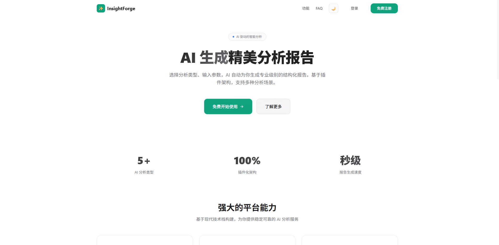
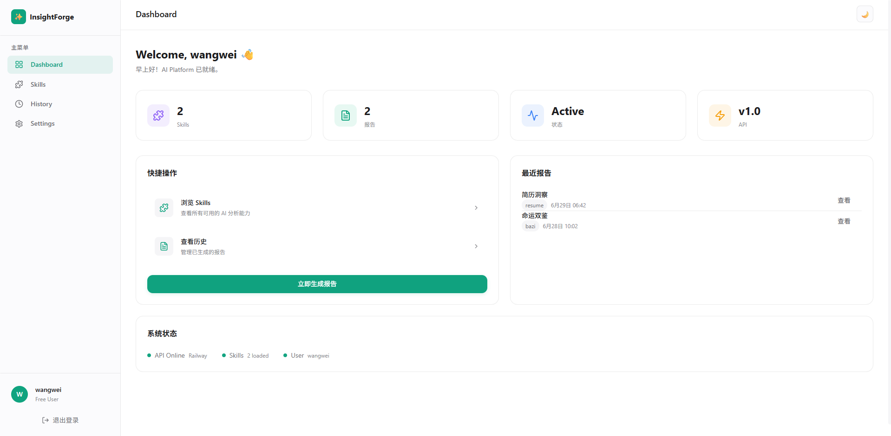
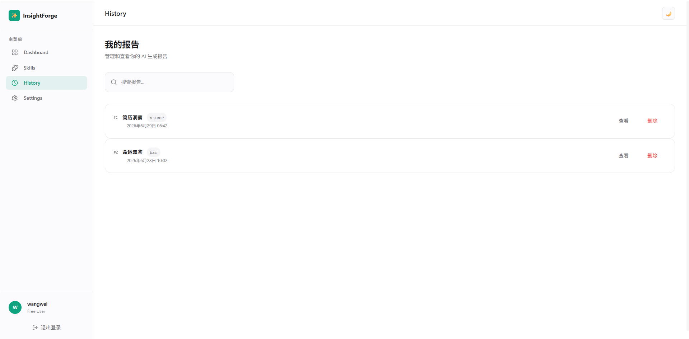
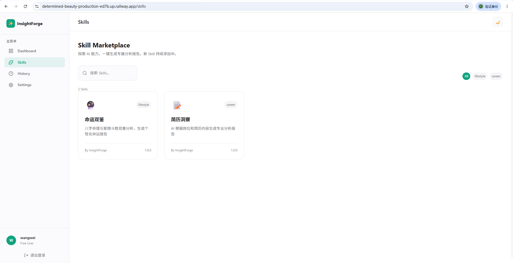

# 🔮 InsightForge-AI

> AI Structured Report Generation Platform — Plugin-based architecture for extensible AI reporting.

[](LICENSE)
[](https://python.org)
[](https://vuejs.org)
[](.)

---

## 📖 Project Introduction

InsightForge-AI is a **plugin-based AI structured report generation platform**. It is NOT a fortune-telling website — Bazi (Chinese Astrology) is just the first Skill example.

The platform provides generic infrastructure (user system, JWT auth, database, Skill scheduling, LLM abstraction) while each **Skill** encapsulates a specific AI capability (prompt, analysis, HTML rendering). Adding a new AI report type requires **zero changes to the Platform** — just drop a new directory under `skills/`.

### Key Design Principle

```
Platform ← SkillRequest / SkillResponse → Skill
```

- **Platform**: Users, JWT, REST API, database, Skill registry/runtime, LLM service, deployment
- **Skill**: Business logic, prompts, AI analysis, HTML rendering
- **Platform never knows what a Skill does internally. Skill never touches the database or auth.**

---

## 🏗 Architecture

```
┌─────────────────────────────────────────────┐
│                  Frontend                    │
│         Vue3 + Element Plus + Pinia          │
│               (Port 5173)                    │
└──────────────────────┬──────────────────────┘
                       │ REST API (JWT)
┌──────────────────────▼──────────────────────┐
│                  Backend                     │
│            FastAPI (Port 8000)               │
│                                              │
│  ┌──────────┐  ┌──────────┐  ┌───────────┐  │
│  │  Auth     │  │  Report  │  │  Skill    │  │
│  │  Service  │  │  Service │  │  Registry │  │
│  └──────────┘  └──────────┘  └─────┬─────┘  │
│                                    │         │
│  ┌─────────────────────────────────▼──────┐  │
│  │         SkillRuntime                    │  │
│  │  ┌─────────┐  ┌────────────────────┐   │  │
│  │  │ Loader  │  │  Workflow Cache    │   │  │
│  │  └─────────┘  └────────────────────┘   │  │
│  └────────────────────────────────────────┘  │
│                    │                          │
│  ┌─────────────────▼──────────────────────┐  │
│  │         LLM Client (Facade)            │  │
│  │  ┌──────────────────────────────────┐  │  │
│  │  │  OpenAICompatibleProvider         │  │  │
│  │  │  (DeepSeek / OpenAI / Qwen ...)   │  │  │
│  │  └──────────────────────────────────┘  │  │
│  └────────────────────────────────────────┘  │
└──────────────────────┬──────────────────────┘
                       │
┌──────────────────────▼──────────────────────┐
│                 Database                     │
│        SQLite (dev) / PostgreSQL (prod)      │
│              User + Report                   │
└─────────────────────────────────────────────┘

                    ┌──────────────────┐
                    │   skills/        │
                    │   (独立目录)     │
                    │                  │
                    │  bazi/           │
                    │    workflow.py   │
                    │    renderer.py   │
                    │    prompt.md     │
                    │    manifest.json │
                    └──────────────────┘
```

### Full Request Flow

```
POST /report/generate  { skill_id, parameters }
    │
    ▼
api/report.py          JWT auth → User object
    │
    ▼
SkillRuntime.run()     Cache lookup → Load workflow → Execute
    │
    ▼
workflow.py            Validate → Load prompt → Fill template
    │
    ▼
LLM Client             POST DeepSeek/OpenAI → AI response
    │
    ▼
renderer.py            AI content → HTML
    │
    ▼
ReportService          Save to DB (user_id, skill_id, html)
    │
    ▼
Response               SkillResponse { report_id, title, html }
```

---

## 🛠 Tech Stack

| Layer | Technology | Version |
|-------|-----------|---------|
| **Backend** | FastAPI | 0.115+ |
| | Uvicorn | 0.30+ |
| | Pydantic | v2 |
| | Python | 3.12+ |
| **Frontend** | Vue | 3.5+ (Composition API) |
| | Vite | 5.4+ |
| | TypeScript | 5.6+ |
| | Element Plus | 2.8+ (on-demand import) |
| | Pinia | 2.2+ |
| | Vue Router | 4.4+ |
| **Database** | SQLAlchemy | 2.0+ |
| | Alembic | 1.13+ |
| | SQLite | Dev (zero-config) |
| | PostgreSQL | 16 (production) |
| **LLM** | DeepSeek-Chat | OpenAI-compatible |
| | Switchable | OpenAI / Qwen / OpenRouter / vLLM |
| **Auth** | bcrypt | 4.2+ |
| | python-jose | 3.3+ (JWT) |
| **Testing** | Pytest | 9.1+ (backend) |
| | Vitest | 2.1+ (frontend) |
| **Deploy** | Docker Compose | 3.9 |
| | Railway | Target platform |

---

## 🚀 Quick Start

### Prerequisites

- Python 3.12+
- Node.js 22+
- Docker (optional, for PostgreSQL/production)

### 1. Clone & Configure

```bash
git clone <repo-url> InsightForge-AI
cd InsightForge-AI
cp .env.example .env
# Edit .env — set your LLM_API_KEY and SECRET_KEY
```

### 2. Backend

```bash
cd backend
pip install -r requirements.txt
python -m alembic upgrade head
uvicorn app.main:app --reload --port 8000
```

### 3. Frontend

```bash
cd frontend
npm install
npm run dev
```

Visit **http://localhost:5173**

### 4. Create Demo Data (Optional)

```bash
cd backend
python ../scripts/seed.py
# Creates demo user: username=demo, password=demo123
```

---

## 🐳 Docker Deploy

```bash
docker compose up -d
docker compose ps
docker compose logs -f
```

---

## ☁️ Railway Deploy

1. Push project to GitHub
2. Connect repo to Railway
3. Set environment variables from `.env.example`
4. Deploy — Railway auto-detects Dockerfile
5. Attach PostgreSQL service

---

## 🧩 Adding a New Skill

Adding a new Skill requires **zero Platform code changes**.

### Step-by-Step

1. **Create the Skill directory**

```bash
mkdir -p skills/career
```

2. **Write `manifest.json`**

```json
{
  "id": "career",
  "display_name": "职业规划",
  "version": "1.0.0",
  "description": "AI 职业发展规划分析",
  "icon": "career",
  "category": "career",
  "entry": "workflow.py",
  "output": "html",
  "parameters": {
    "industry": {
      "type": "select",
      "label": "目标行业",
      "required": true,
      "options": ["互联网", "金融", "医疗", "教育"],
      "default": "互联网"
    },
    "years_experience": {
      "type": "number",
      "label": "工作年限",
      "required": true,
      "min": 0,
      "max": 50,
      "default": 3
    }
  }
}
```

3. **Write `workflow.py`**

```python
import logging
from app.types.skill import SkillRequest, SkillResponse

logger = logging.getLogger(__name__)

async def run(request: SkillRequest) -> SkillResponse:
    try:
        params = request.parameters
        # Validate, build prompt, call LLM, render HTML...
        return SkillResponse(
            success=True,
            title="职业规划报告",
            html="<html>...</html>",
            metadata={"skill": "career", "version": "1.0.0"},
        )
    except Exception as e:
        logger.exception("Career skill error")
        return SkillResponse(
            success=False, title="", html="", metadata={}, error=str(e)
        )
```

4. **Write `prompt.md`** — your AI prompt template

5. **Write `renderer.py`** — HTML renderer

6. **Restart backend** — Skill is auto-discovered on startup

### Skill Directory Structure

```
skills/my_skill/
├── manifest.json    # Required: skill metadata + parameter schema
├── workflow.py      # Required: async def run(request) -> SkillResponse
├── renderer.py      # Required: HTML generation
├── prompt.md        # Required: AI prompt template
├── README.md        # Optional: skill documentation
├── templates/       # Optional: additional templates
├── assets/          # Optional: static assets
└── scripts/         # Optional: utility scripts
```

---

## 📡 API Examples

### Register

```bash
curl -X POST http://localhost:8000/auth/register \
  -H "Content-Type: application/json" \
  -d '{"username": "demo", "password": "demo123"}'
```

### Login

```bash
curl -X POST http://localhost:8000/auth/login \
  -H "Content-Type: application/json" \
  -d '{"username": "demo", "password": "demo123"}'
# Returns: { "access_token": "...", "user": { "id": 1, "username": "demo" } }
```

### List Skills

```bash
curl http://localhost:8000/skill/list
```

### Generate Report

```bash
curl -X POST http://localhost:8000/report/generate \
  -H "Authorization: Bearer <token>" \
  -H "Content-Type: application/json" \
  -d '{"skill_id": "bazi", "parameters": {"year": 1990, "month": 6, "day": 15, "hour": 8, "gender": "男"}}'
```

### List Reports

```bash
curl -H "Authorization: Bearer <token>" http://localhost:8000/report/list
```

### Get Report Detail

```bash
curl -H "Authorization: Bearer <token>" http://localhost:8000/report/1
```

### Delete Report

```bash
curl -X DELETE -H "Authorization: Bearer <token>" http://localhost:8000/report/1
```

---

## 📁 Project Structure

```
InsightForge-AI/
├── README.md
├── LICENSE (MIT)
├── .env.example
├── docker-compose.yml
│
├── docs/
│   ├── PRD.md              # Product Requirements Document
│   ├── CLAUDE.md            # Development conventions & constraints
│   ├── SKILL_SPEC.md        # Skill plugin protocol specification
│   ├── HANDOFF.md           # Project handoff document
│   └── assets/              # Screenshots & diagrams
│
├── backend/
│   ├── app/
│   │   ├── main.py          # FastAPI entry + logging + exception handlers
│   │   ├── api/             # REST endpoints (auth, report, skill)
│   │   ├── core/            # Config, security (bcrypt+JWT), dependencies
│   │   ├── database/        # SQLAlchemy engine + session
│   │   ├── models/          # ORM models (User, Report)
│   │   ├── schemas/         # Pydantic request/response schemas
│   │   ├── services/        # Business logic layer
│   │   ├── runtime/         # Skill execution engine
│   │   ├── registry/        # Skill auto-discovery
│   │   ├── llm/             # LLM abstraction (provider pattern)
│   │   └── types/           # Internal type definitions
│   ├── tests/               # pytest (21 tests, all passing)
│   └── alembic/             # Database migrations
│
├── frontend/
│   ├── src/
│   │   ├── main.ts          # Vue entry (Pinia + Router + global errorHandler)
│   │   ├── App.vue          # Root component
│   │   ├── api/             # HTTP client (JWT inject, ApiError, typed APIs)
│   │   ├── components/      # Shared: AppHeader, LoadingOverlay, ErrorDisplay, StateWrapper
│   │   ├── pages/           # 7 pages: Home, Login, Register, Skill, Report, History, 404
│   │   ├── stores/          # Pinia: auth, skill
│   │   └── router/          # Vue Router + auth guard
│   └── __tests__/           # Vitest (24 tests, all passing)
│
├── skills/
│   └── bazi/                # First Skill: Chinese Astrology analysis
│       ├── manifest.json
│       ├── workflow.py
│       ├── renderer.py
│       └── prompt.md
│
└── scripts/
    ├── init_db.py
    └── seed.py
```

---

## 🖼 Screenshots

> Screenshots pending — add images to `docs/assets/` and reference them here.

| Page | Screenshot |
|------|-----------|
| Home |  |
| Skill Form |  |
| Report |  |
| History |  |

---

## 🧪 Testing

```bash
# Backend tests (21 tests)
cd backend
python -m pytest tests/ -v

# Frontend tests (24 tests)
cd frontend
npx vitest run
```

**Test Status: 45/45 passed ✅**

---

## 📜 License

MIT — see [LICENSE](LICENSE) for details.

---

## 🔮 Roadmap

- [x] Phase 1: Project initialization (FastAPI + Vue3 + Docker)
- [x] Phase 2: Bazi Skill integration (SkillRuntime + LLM Client)
- [x] Phase 3: User system (register/login/JWT/report CRUD)
- [x] Phase 4: Frontend (7 pages, Pinia, dynamic forms)
- [x] Phase 5: Productization (tests, logging, docs, UX polish)
- [ ] Phase 6: Deployment (Docker Compose verification + Railway)
- [ ] More Skills (career, resume, psychology...)
- [ ] PDF export
- [ ] Dark mode
- [ ] i18n internationalization
